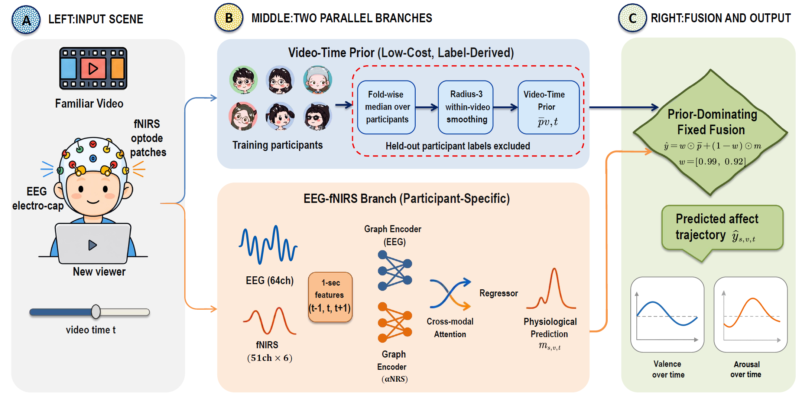
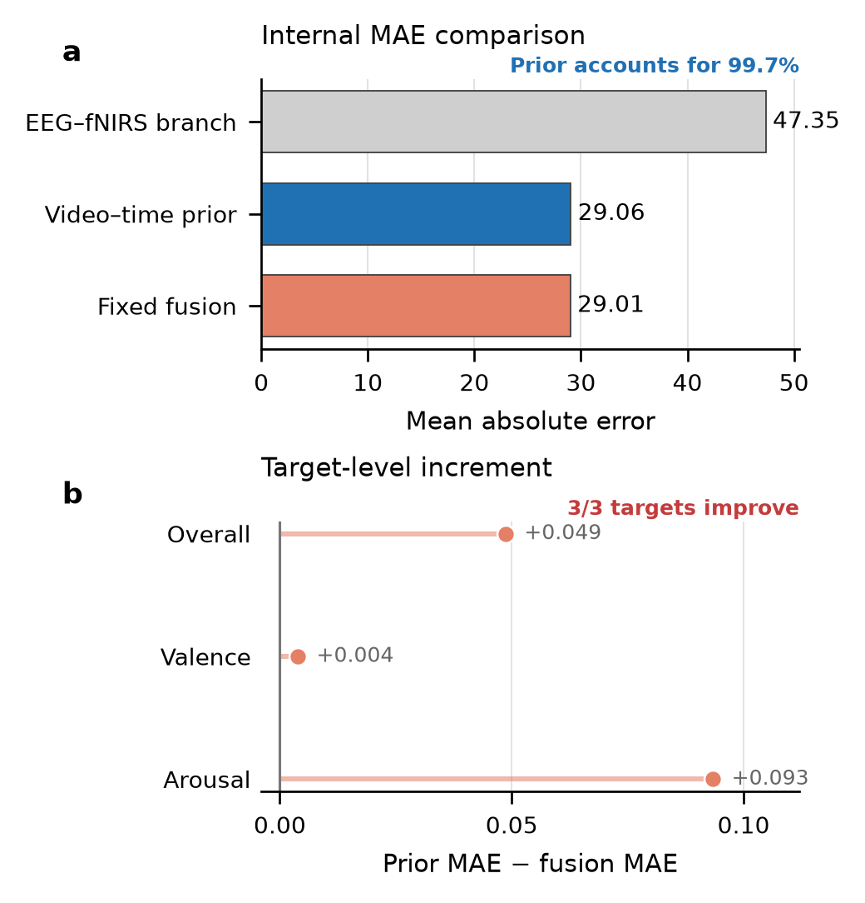
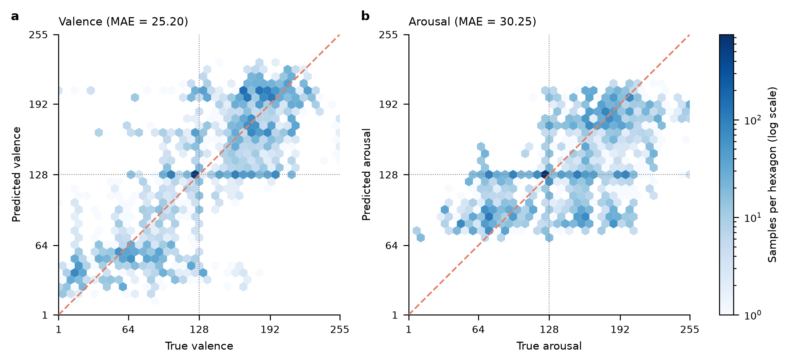
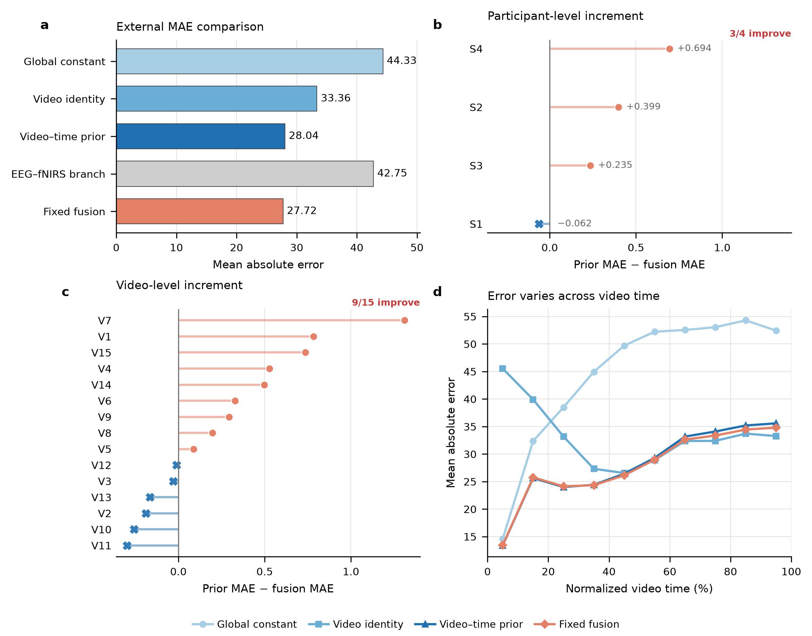
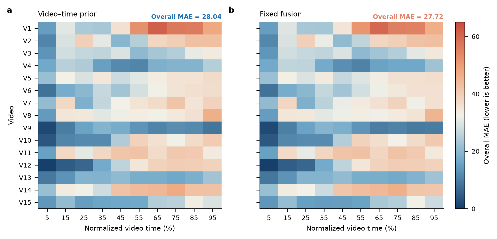
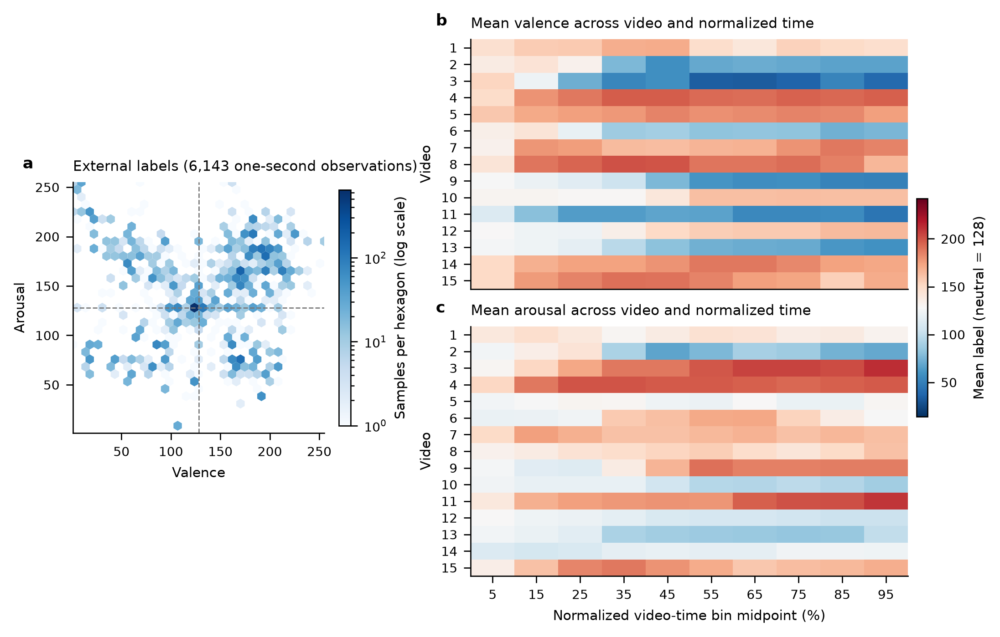

<p align="center">
  <strong>English</strong> · <a href="README_zh.md">中文</a>
</p>

<h1 align="center">Low-MAE EEG–fNIRS Continuous Affect Regression</h1>

<p align="center">
  <strong>Predicting valence–arousal curves for new viewers of familiar videos</strong><br>
  A reproducible Python pipeline that combines a low-cost video–time population prior with EEG–fNIRS predictions.
</p>

<p align="center">
  <a href="https://www.python.org/"></a>
  <a href="#results"></a>
  <a href="#getting-started"></a>
  <a href="LICENSE"></a>
  <a href="https://huggingface.co/datasets/MER-PS/MER-PS-trainval"></a>
</p>

<p align="center">
  <a href="#project-overview">Overview</a> ·
  <a href="#results">Results</a> ·
  <a href="#analysis">Analysis</a> ·
  <a href="#getting-started">Quick Start</a> ·
  <a href="#data">Data</a> ·
  <a href="#reproduction">Reproduction</a> ·
  <a href="#open-source-license">License</a>
</p>

> [!IMPORTANT]
> **Primary objective:** minimize mean absolute error (MAE). Physiological-only and prior-only comparisons are used after the main result to explain where the MAE reduction comes from.

<a id="project-overview"></a>
## Overview

This project predicts 1 Hz continuous valence and arousal for new viewers watching familiar, temporally aligned videos. Because video identity and playback time are available at inference, a protocol-matched video–time prior provides a strong, low-cost population-response baseline: it is fitted within each training fold for five-fold evaluation and on the full development cohort for held-out evaluation. Fixed fusion combines this prior with the EEG–fNIRS branch and achieves the lowest overall MAE under both protocols.

| Research goal | Implemented approach | Evaluation boundary |
| --- | --- | --- |
| Reduce MAE for new viewers of known videos | Protocol-matched video–time prior + EEG–fNIRS branch + fixed fusion | Participant-disjoint evaluation on the same 15 familiar videos |
| Provide a practical population-response baseline | Video identity and within-video time available at inference | Not cross-site, cross-condition, or unseen-video validation |
| Explain the source of the gain | Source decomposition by participant, video, and normalized time | Physiological comparisons are post-result analyses |

Potential uses—treated here as motivations rather than validated downstream outcomes—include estimating approximate audience emotion curves, providing a group-response baseline for editing, advertising, or recommendation, and coarsely initializing predictions for a new viewer.

<p align="center">
  <a href="docs/figures/method_overview.pdf">
    
  </a>
</p>
<p align="center"><em>Figure 1 | A video–time population prior is combined with EEG–fNIRS predictions to minimize MAE.</em></p>

<a id="results"></a>
## Primary MAE results

| Evaluation protocol | Cohort | EEG–fNIRS branch | Video–time prior | Fixed fusion |
| --- | --- | ---: | ---: | ---: |
| Five-fold participant-held-out | 24 participants · 15 videos · 36,864 samples | 47.35 | 29.06 | **29.01** |
| Participant-disjoint held-out | 4 new viewers · 60 trials · 6,143 samples | 42.75 | 28.04 | **27.72** |

**Protocol details.** The five-fold row uses five out-of-fold physiological models, a video–time prior fitted within each training fold, and floating-point predictions. The held-out row uses a six-model physiological ensemble—one full-development model plus five fold models—a video–time prior fitted on the full development cohort, and predictions rounded with `numpy.rint` and then clipped to `[1, 255]` before scoring. The two rows should therefore be interpreted only within their own protocols: **29.01 and 27.72 are not a direct cross-cohort improvement estimate for the same estimator.**

Fixed fusion achieved the lowest MAE in both evaluations. Internally, the video–time prior was only 0.05 points above fusion and reduced MAE by 18.29 points relative to the EEG–fNIRS branch. In the participant-disjoint held-out cohort, fusion improved on the video–time prior by a further 0.32 points.

<p align="center">
  <a href="docs/figures/source_dominance.png">
    
  </a>
</p>
<p align="center"><em>Figure 2 | Internal participant-held-out MAE. The video–time prior accounts for most of the error reduction, while fixed fusion reaches the lowest value.</em></p>

<details>
<summary><strong>Full held-out source decomposition</strong></summary>

| Prediction source | Overall MAE |
| --- | ---: |
| Global constant | 44.33 |
| Video identity prior | 33.36 |
| Video–time prior | 28.04 |
| EEG–fNIRS branch | 42.75 |
| **Fixed fusion** | **27.72** |

</details>

<p align="center">
  <a href="docs/figures/external_prediction_quality.png">
    
  </a>
</p>
<p align="center"><em>Figure 3 | Fixed-fusion predictions versus observed targets. Predictions in both dimensions contract toward the middle of the scale.</em></p>

> [!NOTE]
> This protocol establishes participant disjointness only. It is not independent cross-site or cross-condition external validation, and it does not evaluate unseen videos.

<a id="analysis"></a>
## Analysis after achieving low MAE

The following comparisons explain the source and limits of the lowest MAE; they do not replace MAE reduction as the primary objective.

- The within-fold video–time prior accounts for approximately **99.7%** of the internal MAE reduction from the EEG–fNIRS branch to fixed fusion.
- In held-out evaluation, video identity is associated with a **10.97-point** reduction in overall MAE, and within-video time is associated with a further descriptive reduction of **5.32 points**.
- Fusion gains are heterogeneous, improving performance for **3 of 4 participants** and **9 of 15 videos**.
- The temporal prior is phase dependent: in the first normalized time bin, video identity and video–time priors achieve MAEs of **45.53** and **13.40**, while video identity is slightly better in each of the final five bins.

Detailed methods and analyses are available in [`docs/method.md`](docs/method.md) and [`docs/ablation.md`](docs/ablation.md).

<details>
<summary><strong>Open additional held-out analysis figures</strong></summary>
<br>

<p align="center">
  <a href="docs/figures/external_source_decomposition.png">
    
  </a>
</p>
<p align="center"><em>Figure 4 | Aggregate improvement contains local gains and losses across participants, videos, and playback time.</em></p>

<p align="center">
  <a href="docs/figures/external_video_time_mae.png">
    
  </a>
</p>
<p align="center"><em>Figure 5 | The small aggregate fusion gain is not uniform across video-by-time cells.</em></p>

</details>

<a id="getting-started"></a>
## Quick start

```bash
git clone https://github.com/rudykon/MER2026track4-EEG-fNIRS-Affect-Regression.git
cd MER2026track4-EEG-fNIRS-Affect-Regression

python3 -m venv .venv
.venv/bin/pip install -r requirements.txt
.venv/bin/pip install -e .
source .venv/bin/activate

# Lightweight repository validation; raw data are not required.
PYTHONPATH=src .venv/bin/python -m unittest discover -s tests -v
```

The expected validation result is **15 passing tests**. Full training and evaluation require the MER-PS data. The default requirements install PyTorch 2.5.1 for CUDA 12.1; an NVIDIA GPU is recommended, while `--device auto` can fall back to CPU. Use the appropriate PyTorch wheel for a CPU-only environment. If downloads pass through a SOCKS proxy, `socksio` supplies the network dependency; the held-out download script also requires the system command `jq`.

<a id="data"></a>
## Data preparation

| Data component | Scale | Repository | Default local path |
| --- | ---: | --- | --- |
| Training/validation | 24 participants · 360 trials · 36,864 samples | [MER-PS train/validation](https://huggingface.co/datasets/MER-PS/MER-PS-trainval) | `data/MER_PS_trainval/` |
| Participant-disjoint held-out | 4 participants · 60 trials · 6,143 samples | [Held-out evaluation data](https://huggingface.co/datasets/MER-PS/MER-PS-public-leaderboard-evaluation-data) | `data/download/MER_PS_public_evaluation/` |

The training/validation repository is access-controlled. Request access on its Hugging Face page, authenticate after activating the virtual environment, and then download the approved archive:

```bash
hf auth login
bash scripts/download_data.sh
```

The script downloads and integrity-checks the ZIP archive but does not extract it. It saves the file as `data/download/MER_PS_trainval.zip`. Inspect the top-level entry, then extract and rename that directory without creating an extra nesting level:

```bash
unzip -Z1 data/download/MER_PS_trainval.zip | head

MERPS_ARCHIVE='data/download/MER_PS_trainval.zip'
MERPS_TOP_DIR="$(unzip -Z1 "$MERPS_ARCHIVE" | sed -n '1{s:/$::;p;q}')"
test -n "$MERPS_TOP_DIR"
test ! -e data/MER_PS_trainval
unzip -q "$MERPS_ARCHIVE" -d data/download
mv "data/download/$MERPS_TOP_DIR" data/MER_PS_trainval
```

Download the participant-disjoint held-out data with the local `huggingface_token.json` file:

```bash
MERPS_EXTERNAL_REPO_ID='MER-PS/MER-PS-public-leaderboard-evaluation-data' \
  bash scripts/download_external_data.sh
```

Token files, raw data, and download directories are excluded by `.gitignore`. The held-out script requires the Hugging Face CLI and `jq`, reads the token locally, and does not write it to downloaded files, logs, or version control. Archive inspection and extraction additionally require `unzip`. Verify the current terms on each dataset repository before use or redistribution.

See [`data/DATASET.md`](data/DATASET.md) and [`docs/dataset.md`](docs/dataset.md) for the full directory structure, signal definitions, integrity checks, and data-use boundaries.

<details>
<summary><strong>Open the supplementary data diagnostic</strong></summary>
<br>

<p align="center">
  <a href="docs/figures/external_data_landscape.png">
    
  </a>
</p>
<p align="center"><em>Supplementary diagnostic | Held-out-cohort label coverage and descriptive variation across videos and normalized playback time.</em></p>

</details>

<a id="reproduction"></a>
## Reproduction and audit workflow

The public commands below cover explicit feature reconstruction, fixed-split and five-fold training, prior construction, MAE evaluation, source decomposition, held-out evaluation, model-bundle export, validation, and tests. Full training can take substantial time. The `--test-mode` option runs a three-epoch training check but still requires prepared data. Exact recreation of the reported held-out estimator additionally requires the full-development checkpoint described below.

> [!CAUTION]
> These commands use the default `data/feature_cache/`, `checkpoints/`, and `artifacts/` paths. Feature reconstruction and training can replace files with the same names. Use a clean checkout or pass isolated paths through `--cache-dir`, `--model-dir`, `--log-path`, `--output`, `--checkpoint-dir`, and `--output-dir` when preserving existing local runs matters.

```bash
# 0. Rebuild features from the raw MAT files and check that they load, then stop
PYTHONPATH=src .venv/bin/python scripts/train_split.py \
  --prepare-only --no-cache --device auto

# 1. Train on a fixed 20/4 participant split
PYTHONPATH=src .venv/bin/python scripts/train_split.py --device auto

# 2. Train five participant-held-out folds
PYTHONPATH=src .venv/bin/python scripts/train_cv.py \
  --device auto --metrics-json artifacts/cv_metrics.json

# 3. Build the video–time prior required by held-out evaluation and bundle export
PYTHONPATH=src .venv/bin/python -m merps.prior

# 4. Evaluate five-fold MAE and decompose prediction sources
PYTHONPATH=src PYTHONDONTWRITEBYTECODE=1 \
  .venv/bin/python scripts/evaluate.py \
  --blend-checkpoints \
  --output-json artifacts/source_evaluation.json \
  --source-data-csv artifacts/source_data_components.csv

# 5. Evaluate the held-out cohort; final_v3.pt is preferred, best_v3.pt is the fallback
PYTHONPATH=src PYTHONDONTWRITEBYTECODE=1 \
  .venv/bin/python scripts/evaluate_external.py \
  --source-data-dir artifacts/external_source_data

# 6. Export and validate the local model bundle
.venv/bin/python scripts/export_model_bundle.py
.venv/bin/python scripts/validate_model_bundle.py \
  artifacts/model_bundle_source_explicit.zip \
  --subject test_1 --video 1 --count 8

# 7. Run unit tests
PYTHONPATH=src .venv/bin/python -m unittest discover -s tests -v
```

The reported held-out MAE of **27.72** used `checkpoints/final_v3.pt` as the full-development member of the six-model physiological ensemble. The repository does not currently provide a command that recreates this checkpoint, and trained checkpoints are not version controlled. In a clean checkout, held-out evaluation and bundle export therefore fall back to the fixed-split `checkpoints/best_v3.pt`; this public fallback path remains fully runnable, but its held-out metrics should not be expected to reproduce **27.72** exactly.

The available workflow has been run locally, including reconstruction of an approximately 1.1 GB feature cache, fixed-split and five-fold training, MAE evaluation, source decomposition, held-out evaluation, model-bundle export, and end-to-end inference. Outputs from that earlier isolated audit were retained under the ignored `artifacts/full_pipeline_run/` directory. The commands shown above use their documented defaults instead: training writes checkpoints under `checkpoints/`, general evaluation and export write under `artifacts/`, and held-out evaluation writes under `artifacts/external_evaluation/`.

<a id="repository"></a>
## Repository map

| Path | Purpose |
| --- | --- |
| `src/merps/` | Feature extraction, video–time prior, physiological model, calibration, and inference |
| `scripts/` | Data download, training, evaluation, source decomposition, and model-bundle tools |
| `tests/` | Unit tests for metrics, calibration, source construction, and bundle configuration |
| `docs/` | Method, dataset, and post-result analysis documentation |
| `data/` | Tracked local-data instructions; raw data, downloads, and feature caches are ignored |
| `checkpoints/` | Local physiological checkpoints and priors; not version controlled |
| `artifacts/` | Logs, evaluation outputs, figures, and model bundles; not version controlled |

<a id="scope"></a>
## Scope and sharing boundaries

- The current findings apply to new viewers watching the same 15 familiar videos.
- The study does not establish transfer to unseen videos, new sites, or new experimental conditions.
- Downstream effects on editing, advertising, or recommendation have not yet been validated.
- Local data, feature caches, checkpoints, generated bundles, evaluation outputs, and credentials are excluded from version control.
- Dataset, checkpoint, generated-artifact, and third-party terms must be checked separately before redistribution.

<a id="open-source-license"></a>
## License

Complete source implementations of all algorithms evaluated in this project are provided in this repository. Unless otherwise noted, repository-authored source code is licensed under the [Apache License 2.0](LICENSE). Datasets, model checkpoints, generated artifacts, and third-party dependencies remain subject to their own terms.
