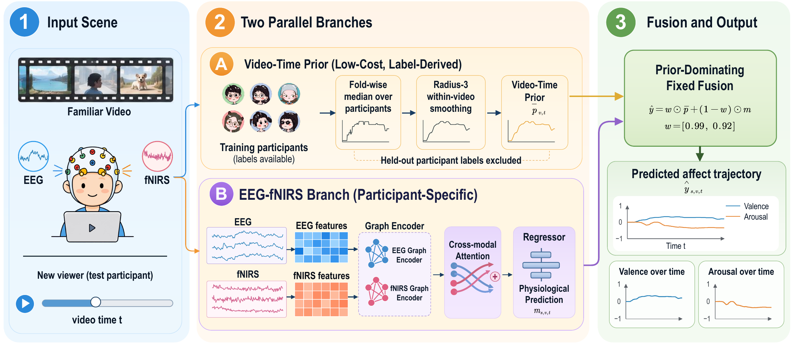
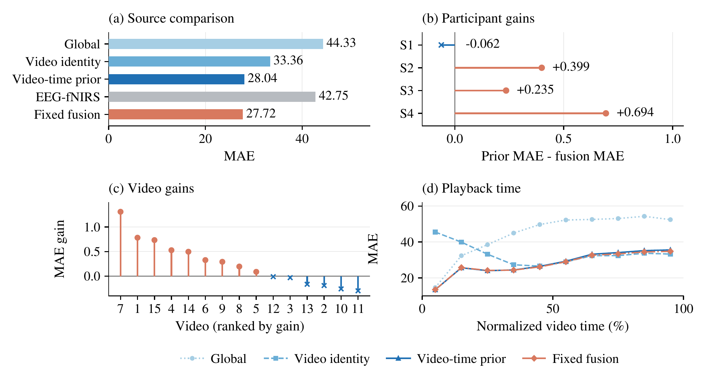
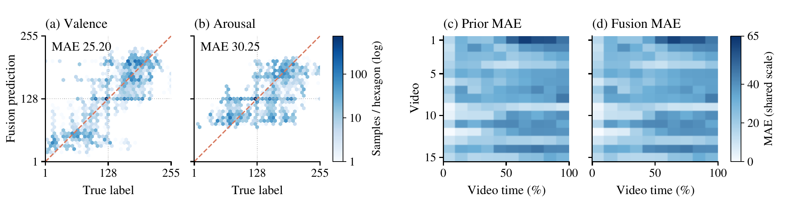

<p align="center">
  <a href="README.md">English</a> · <strong>中文</strong>
</p>

<p align="center">
  
</p>

<h1 align="center">Vtp-Emotion</h1>

<p align="center">
  <strong>Video–Time Priors for EEG–fNIRS Emotion Regression on Familiar Videos</strong><br>
  熟悉视频上的 EEG–fNIRS 情感回归：区分共享刺激反应与个体生理修正。
</p>

<p align="center">
  <a href="https://www.python.org/"></a>
  <a href="LICENSE"></a>
  <a href="https://huggingface.co/datasets/MER-PS/MER-PS-trainval"></a>
</p>

<p align="center">
  <a href="https://rudykon.github.io/Vtp-Emotion/zh/">项目展示页</a> ·
  <a href="https://rudykon.github.io/Vtp-Emotion/zh/demo/">浏览器演示</a> ·
  <a href="#project-overview">概览</a> ·
  <a href="#method">方法</a> ·
  <a href="#results">结果</a> ·
  <a href="#analysis">分析</a> ·
  <a href="#getting-started">快速开始</a> ·
  <a href="#reproduction">复现</a>
</p>

> [!IMPORTANT]
> **核心发现：**相对于 EEG–fNIRS 分支，视频—时间先验贡献了绝大部分 MAE 下降；固定融合带来的额外收益较小，且因参与者和视频而异。评估对象是观看训练中相同视频的新观众；生理分支使用未来上下文，仅支持离线预测。

<a id="project-overview"></a>
## 概览

面对相同视频，新增观众的 EEG 与 fNIRS 信号能否在群体共享反应之外改善连续情感预测？Vtp-Emotion 在 MER-PS 2026 上研究这一问题，以 **1 Hz 预测原始 [1, 255] 标度上的效价与唤醒度**。

推理时已知视频身份及对齐的播放时间，因此可以利用已有观众的标签估计共享情感轨迹。本项目比较**视频—时间先验**、基于图模型的 **EEG–fNIRS 分支**及其**固定权重融合**，并加入全局常数和视频身份基线，进一步区分整体标签水平、视频身份与视频内时间所对应的误差下降。

| 组成 | 推理时输入 | 作用 |
| --- | --- | --- |
| 视频—时间先验 | 已知视频身份与对齐的秒级时间 | 从训练参与者标签估计共享反应，无需采集新观众生理信号 |
| EEG–fNIRS 分支 | 新观众的生理信号、静息基线及时间上下文 | 通过图编码器与双向跨模态注意力预测个体反应 |
| 固定融合 | 先验预测与生理预测 | 效价和唤醒度的先验权重分别为 0.99 和 0.92 |

留出参与者的标签不进入先验构建、特征标准化、模型训练或预测。检查点与融合权重选择**未采用完全嵌套验证**，详见[适用范围与局限](#scope)。

<a id="method"></a>
## 方法

<p align="center">
  <a href="docs/figures/icassp2027/method_overview.pdf">
    
  </a>
</p>
<p align="center"><em>图 1｜熟悉视频回归：折内标签先验与离线 EEG–fNIRS 分支。输出曲线仅作示意；点击各论文图可查看 PDF。</em></p>

1. **构建先验。** 对每个视频、时间点和目标维度，取可用训练参与者标签的中位数，再在视频边界内进行半径为 3 的滑动平均。内部评估逐折重建先验；外部队列评估使用全部 24 名开发集参与者。
2. **提取生理特征。** 使用对应的五秒静息基线中心化信号，并将 EEG 重采样到 200 Hz。EEG 特征包括六个频带的相对对数功率、微分熵和 Hjorth 统计量；fNIRS 对 HbO、HbR、HbT 及 780、805、830 nm 吸光度分别提取均值、标准差、斜率、偏度和峰度。拼接 `t−1`、`t`、`t+1` 后，EEG 与 fNIRS 张量分别为 `64 × 45` 和 `51 × 90`，试次边界使用边缘填充。
3. **预测与融合。** 可学习邻接矩阵的图编码器使用 32 维通道嵌入，通过四头双向跨模态注意力交互后输入回归器。折模型采用 MSE 加 `0.01 ×` 对比对齐损失、`0.7` dropout、AdamW，以及基于验证 MSE 的早停。预测还原到原始标度后按下式融合：

```text
prediction = [0.99, 0.92] * video_time_prior
           + [0.01, 0.08] * eeg_fnirs_prediction
# 目标顺序：[效价, 唤醒度]。
```

外部队列保持相同权重，不使用静息输出校准。由于包含 `t+1` 生理特征，该方法属于**离线估计器**。

<a id="results"></a>
## 实验结果

所有数值均为**原始 [1, 255] 标度上按样本汇总的 MAE**，越低越好；粗体表示同一协议内所比较变体的最低值。

**内部评估：五折参与者留出，24 名参与者、15 个视频、360 次试次、36,864 个秒级样本。**

| 变体 | 总体 | 效价 | 唤醒度 |
| --- | ---: | ---: | ---: |
| EEG–fNIRS 分支 | 47.35 | 51.35 | 43.35 |
| 视频—时间先验 | 29.06 | 26.67 | 31.46 |
| **固定融合** | **29.01** | **26.66** | **31.37** |

**外部队列：4 名未参与训练的新参与者、相同的 15 个视频、60 次试次、6,143 个秒级样本。**

| 变体 | 总体 | 效价 | 唤醒度 |
| --- | ---: | ---: | ---: |
| 全局常数 | 44.33 | 47.46 | 41.20 |
| 视频身份 | 33.36 | 32.56 | 34.17 |
| EEG–fNIRS 分支 | 42.75 | 45.29 | 40.21 |
| 视频—时间先验 | 28.04 | 25.34 | 30.74 |
| **固定融合** | **27.72** | **25.20** | **30.25** |

全局常数为全部开发集标签逐维计算的中位数；视频身份基线为每个视频平滑先验沿时间取中位数得到的常量。

| 协议细节 | 内部评估 | 外部队列 |
| --- | --- | --- |
| 生理预测 | 每名参与者对应的留出折模型 | 五个折模型与一个全开发集检查点的输出平均 |
| 先验与特征标准化 | 仅使用对应折的训练参与者 | 先验使用全部 24 人；各检查点使用各自训练时的标准化统计量 |
| 评分 | 汇总全部折外浮点预测 | 各变体先经 `numpy.rint` 取整，再裁剪至 `[1, 255]` |

**29.01 与 27.72 不能直接解释为跨队列提升：**参与者、集成方式和取整规则均不同。外部队列仅验证熟悉视频条件下的参与者不重叠评估，不证明跨站点或未见视频泛化。

<a id="analysis"></a>
## 误差下降来自哪里？

在外部队列中，从全局常数改为视频身份，总体 MAE 降低 **10.97 点**；加入播放时间再降低 **5.32 点**；固定融合在视频—时间先验之上再降低 **0.32 点**。内部评估中，融合的额外收益仅为 **0.05 点**。

以 EEG–fNIRS 单独预测到固定融合的误差下降为分母，先验在内部和外部评估中分别贡献 **99.73%** 和 **97.89%**，使用显示舍入前的 MAE 计算。这些比例描述误差下降，不构成信号信息含量的因果分解。

<p align="center">
  <a href="docs/figures/icassp2027/external_source_decomposition.pdf">
    
  </a>
</p>
<p align="center"><em>图 2｜预测来源及融合收益的异质性。“先验 MAE − 融合 MAE”为正表示融合改善；圆点表示收益，叉号表示损失。</em></p>

| 外部队列：固定融合相对于先验 | 观察结果 |
| --- | --- |
| 参与者 | 4 人中 3 人的 MAE 降低 |
| 视频 | 15 个中 9 个的 MAE 降低；最大收益 +1.31（V7），最大损失 −0.30（V11） |
| 参与者×视频试次 | 60 次中 38 次的 MAE 降低，22 次升高 |
| 归一化播放时间 | 前 3 个分箱 MAE 升高，后 7 个降低 |
| 视频×时间单元 | 150 个单元中 76 个 MAE 降低、7 个持平、67 个升高 |

时间条件化的收益同样不均匀。第一个归一化时间分箱中，视频身份与视频—时间先验的 MAE 分别为 **45.53** 和 **13.40**；但在后五个分箱中，视频身份逐箱更好。先验在前半段按样本汇总的 **11.89 点下降**抵消了后半段的 **1.33 点上升**。

<p align="center">
  <a href="docs/figures/icassp2027/external_diagnostics.pdf">
    
  </a>
</p>
<p align="center"><em>图 3｜使用全部 6,143 个外部样本的诊断。两张预测密度图共享对数计数色标，两张误差热图共享 0–65 MAE 色标。</em></p>

预测范围存在压缩，且先验与融合各自误差最高的 10 个单元中有 **9 个重合**，说明融合后仍保留了先验的大部分误差结构。

<details>
<summary><strong>事后融合权重敏感性分析</strong></summary>

在 0 到 1 范围内以 0.01 为步长扫描先验权重，内部逐目标最优值为 `[0.99, 0.92]`；使用该权重时，融合仅在 5 折中的 3 折优于先验。这项扫描不构成原始权重选择过程的重现。外部队列最优值移至 `[0.83, 0.82]`（MAE 26.91），但使用了留出结果，仅作事后诊断。所有主结果均保留原始固定权重 `[0.99, 0.92]`。

</details>

以上均为描述性分析。外部队列仅有四个参与者簇，不将相关的秒级样本视为独立重复进行显著性检验。

<a id="getting-started"></a>
## 快速开始

```bash
git clone https://github.com/rudykon/Vtp-Emotion.git
cd Vtp-Emotion

python3 -m venv .venv
.venv/bin/pip install -r requirements.txt
.venv/bin/pip install -e .
source .venv/bin/activate

# 轻量仓库验证，不需要原始数据。
PYTHONPATH=src .venv/bin/python -m unittest discover -s tests -v
```

预期结果为 **15 项测试全部通过**。正式训练与评估需要 MER-PS 数据。默认依赖安装面向 CUDA 12.1 的 PyTorch 2.5.1；推荐使用 NVIDIA GPU，但 `--device auto` 可回退到 CPU，纯 CPU 环境需改用对应的 PyTorch 安装包。若下载环境经过 SOCKS 代理，`socksio` 用于补齐网络依赖；留出数据下载脚本还需要系统命令 `jq`。

<a id="data"></a>
## 数据准备

| 数据组成 | 规模 | 数据仓库 | 默认本地路径 |
| --- | ---: | --- | --- |
| 训练/验证数据 | 24 名参与者 · 360 次试验 · 36,864 个样本 | [MER-PS 训练/验证数据](https://huggingface.co/datasets/MER-PS/MER-PS-trainval) | `data/MER_PS_trainval/` |
| 参与者不重叠留出数据 | 4 名参与者 · 60 次试验 · 6,143 个样本 | [留出评估数据](https://huggingface.co/datasets/MER-PS/MER-PS-public-leaderboard-evaluation-data) | `data/download/MER_PS_public_evaluation/` |

训练/验证数据仓库需要访问许可。请先在 Hugging Face 页面申请访问，在激活虚拟环境后完成认证，再下载压缩包：

```bash
hf auth login
bash scripts/download_data.sh
```

脚本只下载并执行 ZIP 完整性检查，不负责解压；压缩包保存为 `data/download/MER_PS_trainval.zip`。先查看顶层目录，再解压并重命名，避免形成重复嵌套：

```bash
unzip -Z1 data/download/MER_PS_trainval.zip | head

MERPS_ARCHIVE='data/download/MER_PS_trainval.zip'
MERPS_TOP_DIR="$(unzip -Z1 "$MERPS_ARCHIVE" | sed -n '1{s:/$::;p;q}')"
test -n "$MERPS_TOP_DIR"
test ! -e data/MER_PS_trainval
unzip -q "$MERPS_ARCHIVE" -d data/download
mv "data/download/$MERPS_TOP_DIR" data/MER_PS_trainval
```

使用本地 `huggingface_token.json` 下载参与者不重叠留出数据：

```bash
MERPS_EXTERNAL_REPO_ID='MER-PS/MER-PS-public-leaderboard-evaluation-data' \
  bash scripts/download_external_data.sh
```

令牌文件、原始数据和下载目录均由 `.gitignore` 排除。留出数据脚本依赖 Hugging Face CLI 与 `jq`，只在本地读取令牌，不会把令牌写入下载文件、日志或版本控制；查看和解压训练压缩包还需要 `unzip`。使用或重新分发前，请核对各数据仓库当前条款。

完整目录结构、信号定义、完整性校验和数据使用边界见 [`data/DATASET.md`](data/DATASET.md) 与 [`docs/dataset.md`](docs/dataset.md)。

<details>
<summary><strong>展开补充数据诊断图</strong></summary>
<br>

<p align="center">
  <a href="docs/figures/external_data_landscape.png">
    
  </a>
</p>
<p align="center"><em>补充数据诊断｜留出队列标签覆盖及其随视频和归一化播放时间的描述性变化。</em></p>

</details>

<a id="reproduction"></a>
## 复现与审计流程

以下公开命令覆盖显式特征重建、固定划分与五折训练、先验构建、MAE 评估、来源分解、留出队列评估、模型包导出、验证和测试。正式训练可能持续较长时间；`--test-mode` 可执行三轮训练检查，但仍需要已准备的数据。精确重建文中报告的留出估计器，还需要下文说明的全开发集检查点。

> [!CAUTION]
> 以下命令使用默认的 `data/feature_cache/`、`checkpoints/` 与 `artifacts/` 路径，特征重建与训练可能替换同名文件。若需保留已有本地运行，请使用全新检出目录，或通过 `--cache-dir`、`--model-dir`、`--log-path`、`--output`、`--checkpoint-dir` 和 `--output-dir` 指定隔离路径。

```bash
# 0. 从原始 MAT 文件强制重建特征并检查可读取性，然后停止
PYTHONPATH=src .venv/bin/python scripts/train_split.py \
  --prepare-only --no-cache --device auto

# 1. 固定 20/4 参与者划分训练
PYTHONPATH=src .venv/bin/python scripts/train_split.py --device auto

# 2. 五折参与者留出训练
PYTHONPATH=src .venv/bin/python scripts/train_cv.py \
  --device auto --metrics-json artifacts/cv_metrics.json

# 3. 构建留出评估和模型包导出所需的视频—时间先验
PYTHONPATH=src .venv/bin/python -m merps.prior

# 4. 五折 MAE 评估与来源分解
PYTHONPATH=src PYTHONDONTWRITEBYTECODE=1 \
  .venv/bin/python scripts/evaluate.py \
  --blend-checkpoints \
  --output-json artifacts/source_evaluation.json \
  --source-data-csv artifacts/source_data_components.csv

# 5. 留出队列评估：优先使用 final_v3.pt，否则回退到 best_v3.pt
PYTHONPATH=src PYTHONDONTWRITEBYTECODE=1 \
  .venv/bin/python scripts/evaluate_external.py \
  --source-data-dir artifacts/external_source_data

# 6. 导出并验证本地模型包
.venv/bin/python scripts/export_model_bundle.py
.venv/bin/python scripts/validate_model_bundle.py \
  artifacts/model_bundle_source_explicit.zip \
  --subject test_1 --video 1 --count 8

# 7. 单元测试
PYTHONPATH=src .venv/bin/python -m unittest discover -s tests -v
```

文中报告的留出 MAE **27.72** 使用 `checkpoints/final_v3.pt` 作为六模型生理集成中的全开发集模型。本仓库目前没有提供重建该检查点的训练命令，训练后检查点也不纳入版本控制。因此，在干净仓库中，留出评估与模型包导出会回退到固定划分生成的 `checkpoints/best_v3.pt`；这条公开回退路径可以完整运行，但其留出指标不应被期望精确复现 **27.72**。

训练检查点写入 `checkpoints/`；评估产物与模型包写入 `artifacts/`，其中外部队列评估写入 `artifacts/external_evaluation/`。

<a id="repository"></a>
## 项目结构

| 路径 | 作用 |
| --- | --- |
| `src/merps/` | 特征提取、视频—时间先验、生理模型、校准和推理 |
| `scripts/` | 数据下载、训练、评估、来源分解和模型包工具 |
| `tests/` | 指标、校准、来源构建和模型包配置单元测试 |
| `docs/` | 补充方法、数据集及分析文档 |
| `docs/figures/icassp2027/` | 方法与结果图件，提供 PNG 预览与 PDF 版本 |
| `data/` | 跟踪本地数据说明；原始数据、下载文件和特征缓存均被忽略 |
| `checkpoints/` | 本地生理模型检查点与先验；不纳入版本控制 |
| `artifacts/` | 日志、评估产物、图件和模型包；不纳入版本控制 |

<a id="scope"></a>
## 适用范围与局限

- **仅限熟悉视频。** 训练与评估使用相同的 15 个视频，尚未评估未见视频、跨站点或跨实验条件迁移。
- **生理分支为离线方法。** 特征包含 `t+1`，未针对 fNIRS 血流动力学延迟做时滞补偿。
- **选择过程限制。** 检查点和权重选择未完全嵌套；需要完全嵌套的参与者划分，更可靠地估计较小的融合增益。
- **仅评估一种生理架构。** 未单独隔离 EEG、fNIRS、图结构和注意力的贡献；结果既不能证明，也不能排除任一模态包含独立情感信息。
- **描述性比较。** 四名外部参与者对总体差异的证据有限，秒级观测之间存在相关性。
- **部署收益尚未测量。** 先验需要已有观众标签，但无需新增生理信号采集；延迟、能耗和下游应用收益均未测量。

本仓库公开源程序、数据描述、方法与使用说明，以及选定的图片。`website/assets/demo/` 下获授权的浏览器演示资源是模型与数据的唯一例外，包含推理模型和一段 30 秒真实特征，采用 CC BY-NC-SA 4.0。其他原始与处理后的数据、训练检查点、方案设计修改记录、论文及论文图片生成程序均保留在本地，不纳入版本控制。凭据、特征缓存和本地运行产物同样排除；数据集与第三方组件分别适用其自身条款。


## 浏览器演示

[打开浏览器演示](https://rudykon.github.io/Vtp-Emotion/zh/demo/)。计算在访问者电脑的 CPU 上通过后台线程执行。页面自动下载训练好的六模型集成和 30 秒真实 EEG–fNIRS 特征，在本机计算预测，无需账号、手动选择文件或推理服务器。也可选择自己的本地模型与特征文件，这些文件不会上传。

默认片段来自 [MER-PS 训练/验证数据](https://huggingface.co/datasets/MER-PS/MER-PS-trainval)，对应 `test_1`、视频 1、第 0–29 秒，用于展示真实记录上的推理过程，不作为留出准确率评估。公开模型和样本采用 [CC BY-NC-SA 4.0](https://creativecommons.org/licenses/by-nc-sa/4.0/)，详见[来源说明](website/assets/demo/NOTICE.txt)和[带校验值的资源清单](website/assets/demo/manifest.json)。

如需使用自己的文件，安装仓库常规依赖、准备好本地数据和检查点后，导出私有文件：

```bash
.venv/bin/pip install -r requirements-demo.txt
.venv/bin/python scripts/export_browser_demo.py model
.venv/bin/python scripts/export_browser_demo.py input \
  --data-root data/MER_PS_trainval --subject test_1 --video 1 --count 60
```

切换至「使用自己的本地模型与数据」，选择 `artifacts/browser/model.vtp-model.json` 和 `artifacts/browser/input.vtp-input.json`。MAT 特征预处理在本机 Python 中完成；浏览器通过 ONNX Runtime Web 执行各检查点标准化、六模型集成、先验查询、固定融合及向偶数取整。上文关于 `best_v3.pt` 回退检查点的复现限制仍然适用。其他本地导出文件不纳入发布。

网站构建会下载经过完整性校验的 ONNX Runtime Web 1.22.0 运行库，与静态页面一同部署。浏览器数值和输入校验测试使用 `node --test tests/test_browser_demo.cjs`（Node.js 22）。

<a id="open-source-license"></a>
## 开源许可证

本仓库完整提供了本项目评估的全部算法源码实现。除另有说明外，仓库中由项目作者编写的源代码采用 [Apache License 2.0](LICENSE) 开源；数据集、模型检查点、生成产物和第三方依赖仍分别适用其自身条款。
